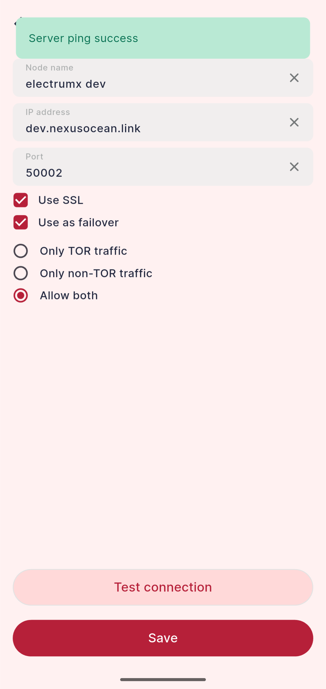

# Firo ElectrumX Docker

A Docker Compose setup for running a Firo full node (`firod`) alongside an ElectrumX server.

> Designed for Ubuntu 22.04+ / Debian-based systems.

## Recommended Server Specs

- 4 Core CPU
- 8GB+ RAM
- 50GB free disk space (Firo chain + ElectrumX db)



## Setup

### 1. Generate RPC credentials

```bash
python3 rpcauth.py firoelectrumx
```

### 2. Configure environment

```bash
cp .env.example .env
```

Fill in the values from the `rpcauth.py` output and set your `REPORT_HOST`.

### 3. Start

```bash
docker compose up -d
```

## Notes

- `ALLOW_ROOT=true` is set in the ElectrumX container to avoid permission issues.
- Adjust `cpus` and `memory` limits in `compose.yml` to suit your hardware.

## Ports

| Port  | Service   | Description     |
|-------|-----------|-----------------|
| 8168  | firod     | P2P network     |
| 8888  | firod     | RPC             |
| 50001 | electrumx | Electrum TCP    |
| 50002 | electrumx | Electrum SSL    |

- **8168** is safe and encouraged to open publicly for peering
- **8888** should remain firewalled — never expose RPC publicly
- **50001** is plaintext — it is recommended to front it with Nginx on port 50002 with SSL

## Production: SSL with Nginx

For public-facing deployments it is recommended to use Nginx as a reverse proxy for SSL termination. ElectrumX runs plain TCP internally on port 50001 and Nginx handles SSL on port 50002.

### 1. Install Nginx and Certbot

```bash
apt install nginx certbot python3-certbot-nginx libnginx-mod-stream -y
```

### 2. Obtain a certificate

```bash
certbot --nginx -d your.domain
```

### 3. Configure Nginx stream

Outside of the http block, add this to the bottom of `/etc/nginx/nginx.conf`:

```nginx
stream {
    upstream electrumx {
        server 127.0.0.1:50001;
    }
    server {
        listen 50002 ssl;
        proxy_pass electrumx;
        ssl_certificate /etc/letsencrypt/live/your.domain/fullchain.pem;
        ssl_certificate_key /etc/letsencrypt/live/your.domain/privkey.pem;
        ssl_protocols TLSv1.2 TLSv1.3;
    }
}
```

### 4. Reload Nginx

```bash
systemctl reload nginx
```

### 5. Open firewall ports

```bash
ufw allow 8168/tcp
ufw allow 50002/tcp
```

Certbot will auto-renew your certificate via a systemd timer.
